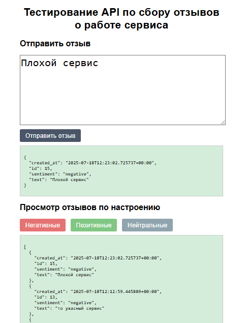

# Review Sentiment Service

Мини-сервис для анализа настроения отзывов пользователей с простым веб-интерфейсом.


# Установка и запуск

```sh
    pip install flask pydantic
    python app.py
```

Сервис запускается на http://127.0.0.1:5000.

    Отправка отзыва: 
    Введите текст в форму и нажмите "Отправить отзыв" для отправки POST-запроса на /reviews. 
    Результат отобразится ниже формы без перезагрузки страницы.
    
    Для просмотра отзывов выберете одну из трех кнопок. Ответ отобразиться в формате json

# Примеры запросов

    curl http://127.0.0.1:5000/
    curl -X POST http://127.0.0.1:5000/reviews -H "Content-Type: application/json" -d '{"text": "Это ужасный сервис"}'
    {
      "id": 1,
      "text": "Это ужасный сервис",
      "sentiment": "negative",
      "created_at": "2025-07-18T12:47:23.123456"
    }

    curl.exe -X POST http://127.0.0.1:5000/reviews -H "Content-Type: application/json" -d "{}"
    {
          "error": "[{
                'type': 'missing', 
                'loc': ('text',), 
                'msg': 'Field required', 
                'input': {}, '
                url': 'https://errors.pydantic.dev/2.11/v/missing'}
        ]"
    }

    curl http://127.0.0.1:5000/reviews?sentiment=negative
    [
        {
            "id": 2,
            "text": "Это ужасный сервис",
            "sentiment": "negative",
            "created_at": "2025-07-18T12:47:23.123456"
        },
        {
            "id": 1,
            "text": "Плохое обслуживание",
            "sentiment": "negative",
            "created_at": "2025-07-18T12:46:22.654321"
        }
    ]
    curl http://127.0.0.1:5000/reviews?sentiment=positive
    curl http://127.0.0.1:5000/reviews?sentiment=neutral


# Примечание
* База данных reviews.db создается автоматически при запуске.
* Настроение определяется по простому словарю:
  * Позитивные слова: "хорош", "люблю", "круто", "отличн"
  * Негативные слова: "плох", "ненавиж", "ужасн", "глюч"
  * Остальное: neutral
* Веб-интерфейс использует минимальный JavaScript для асинхронных запросов без перезагрузки страницы и встроенный CSS для
стилизации.
* Отзывы в GET /reviews сортируются по времени создания (от новых к старым).